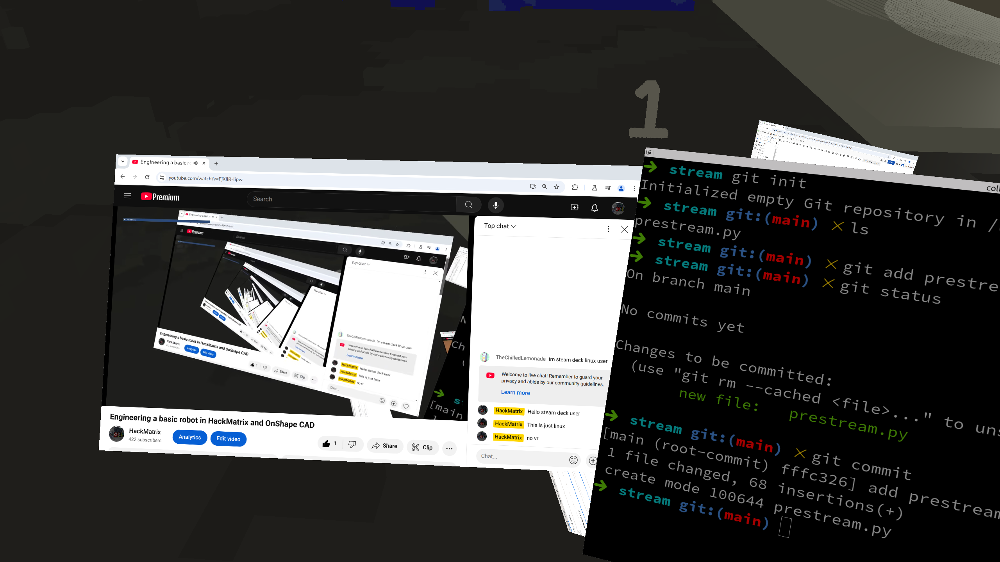

# Stream Scripts Collection



A collection of scripts and tools for managing YouTube streaming presentations, including timers and stream break displays.

## 🎯 Features

- Start stream countdown timer
- Break timer with customizable duration
- Stream ending sequence
- Overlay management scripts
- Dynamic text displays

## 🚀 Getting Started

### Prerequisites

- Python 3.8 or higher
- OBS Studio or similar streaming software
- Required Python packages:
  ```
  pip install -r requirements.txt
  ```

### Installation

1. Clone the repository:
   ```bash
   git clone https://github.com/yourusername/stream-scripts.git
   cd stream-scripts
   ```

2. Install dependencies:
   ```bash
   pip install -r requirements.txt
   ```

3. Configure your settings in `config.json`

## 📜 Available Scripts

### Stream Start Timer
```bash
python scripts/start_timer.py --duration 5
```
Displays a countdown timer for stream start with custom animations.

### Break Timer
```bash
python scripts/break_timer.py --minutes 10 --message "Be Right Back!"
```
Shows a break timer with customizable duration and message.

### Stream End Sequence
```bash
python scripts/end_sequence.py
```
Triggers the end of stream sequence with fade-out effects.

## ⚙️ Configuration

Edit `config.json` to customize:
- Timer fonts and colors
- Display messages
- Animation effects
- Overlay positions

Example configuration:
```json
{
  "timer": {
    "font": "Arial",
    "size": 48,
    "color": "#ffffff"
  }
}
```

## 🎨 Customization

### Adding Custom Overlays

1. Place your overlay images in the `assets` folder
2. Reference them in your script:
   ```python
   overlay_path = "assets/your_overlay.png"
   ```

### Creating New Timer Styles

Modify the CSS in `styles/timers.css` to create custom timer appearances.

## 📝 Contributing

1. Fork the repository
2. Create your feature branch (`git checkout -b feature/AmazingFeature`)
3. Commit your changes (`git commit -m 'Add some AmazingFeature'`)
4. Push to the branch (`git push origin feature/AmazingFeature`)
5. Open a Pull Request

## 📜 License

This project is licensed under the MIT License - see the [LICENSE](LICENSE) file for details.

## 🙏 Acknowledgments

- OBS Studio for streaming software integration
- Python community for various helpful packages
- Contributors and bug reporters

## 📞 Support

For issues and feature requests, please use the GitHub issues tracker.

---
Made with ❤️ for the streaming community
